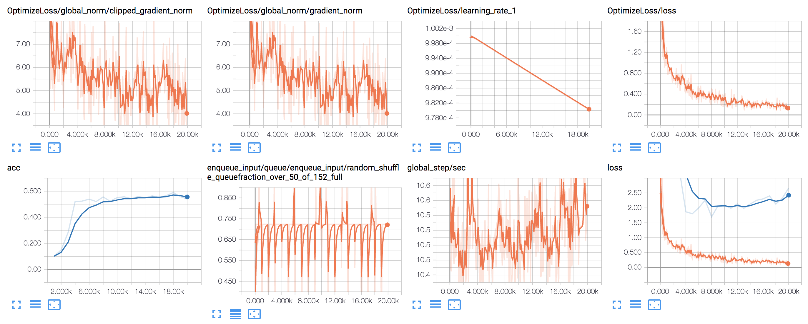

# ml-urban-sound: UrbanSound classification attempts

## About this classifier
This is example for UrbanSound8K classification based on "[End-to-end baseline TF Estimator LB0.72](https://www.kaggle.com/alexozerin/end-to-end-baseline-tf-estimator-lb-0-72)" at Keggle competition.

Before applying to UrbanSound8K, prepared followings.
- Cleaning all the wave file in UrbanSound8K to be 16kHz & 16bit format to make it consistent. It was verrrry slow to clense audio format online. Cleaning everything in advance made it 10 times or more faster.
- Preparing data lists for training set and validation set.

The original example uses [TF Estimator](https://www.tensorflow.org/extend/estimators) high-level API framework, the changes made here are:
- Loading datasets is for UrbanSound8K.
- data_generator to fit to UrbanSound problem.

So how's the accuracy? It's about 54%, this is done even without fitting model and learning etc to the UrbanSound problem.

## Before you begin...
Prepare UrbanSound8K dataset. Un-tar and copy or symbolic-link to your repository copy folder.

Then the 16mUrbanSound8K will be created by running the 2nd notebook that converts UrbanSound8K data.

## Notebooks
- To create data lists: [1_urban_sound_validation_lister.ipynb](1_urban_sound_validation_lister.ipynb)
- To clean all wave files: [2_urban_sound_convert_to_16kmono.ipynb](2_urban_sound_convert_to_16kmono.ipynb)
- First classification just by transferring other problem solution: [3_urban_sound_classification_TF_estimator.ipynb](3_urban_sound_classification_TF_estimator.ipynb)

## Example learning log

